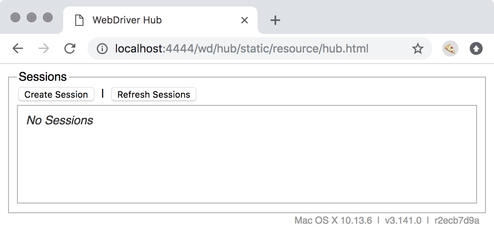

## 1.2.3 Installing WebdriverIO and Basic Usage

The time has finally come! We've laid all the groundwork to understand the nuts and bolts behind UI testing. Now it's time to write some tests!

To start off, we're going to create a new folder for our first example. In a directory of your choice, make a new folder called `wdio-standalone`:

```sh
mkdir wdio-standalone
```

Why `wdio-standalone`?

Well, WebdriverIO allows you to use it through two modes. The first, which we're going through here, is called "standalone" mode. It's meant as a simple way to use WebdriverIO, and allows you to build wrappers around the tool. 

"Testrunner" mode, which we'll cover in the next section, is a bit more complicated. It provides an entire set of tools and hooks for full-fledged integration testing. I mentioned that standalone mode allows you to build wrappers around it. Well, the testrunner is essentially that.

Right now, just to introduce you to WebdriverIO, we're going to use the standalone runner. This is only for this exercise though, as we'll be upgrading to the testrunner soon.

With all that said, let's 'move' our terminal into this `wdio-standalone` folder:

```sh
cd wdio-standalone
```

(For Windows, it's the same command for both actions)

Inside our new folder, we're going to initialize it as an NPM project. This will allow us to save the project dependencies that we'll be installing through NPM.

To do that, run:

```sh
npm init -y
```

The `-y` will answer 'yes' to all the prompts, giving us a standard NPM project. Feel free to omit the `-y` if you'd like to specify your project details.

With that out of the way, let's install WebdriverIO:

```sh
npm install webdriverio@8
```

_Note: We include the `@8` version number so that the version you install is compatible with the examples in this book. If you'd like, you can leave the `@8` part off, but be warned that some code may not work._

Now is a good time to mention that WebdriverIO is split into multiple NPM packages. We'll be looking at those packages in detail later on, but note that installing `webdriverio` via the command above does not give you everything.

What it does give us is a Node.js module that we can use inside of a Node.js file. Let's use that.

First, we'll create a new file called 'test.js':

```sh
touch test.js
```
 
On Windows, that command is:

```text
type nul > test.js
```

Now we have an empty file to add our first test to. Go ahead and open that file up in the text editor of your choice.

Next, we'll copy an example given on the official WebdriverIO website. Throw the following code into your `test.js` file and save it:

{title="test.js"}
```js
const { remote } = require('webdriverio');

(async () => {
    const browser = await remote({
        logLevel: 'trace',
        capabilities: {
            browserName: 'chrome'
        }
    })

    await browser.url('https://duckduckgo.com')

    const inputElem = await browser.$('[aria-label="Search with DuckDuckGo"]')
    await inputElem.setValue('WebdriverIO')

    const submitBtn = await browser.$('[aria-label="Search"]')
    await submitBtn.click()

    console.log(await browser.getTitle()) // outputs: "WebdriverIO at DuckDuckGo"

    await browser.deleteSession()
})().catch((e) => console.error(e))
```

Here's a quick overview of the file:

1. We load the `remote` object from the WebdriverIO package.
2. We wrap our code in an `async` function so we can use `await` statements.
3. We create a new session using `remote`, saving the reference to a `browser` object which we use to send commands.
4. We send a `url` command, requesting the browser go to the DuckDuckGo website.
5. We then get an 'element reference' to the search input textbox.
6. We use that element to call as `setValue` command, which enters 'WebdriverIO' into the textbox.
7. We get a second element, this time the 'Search' button.
8. We trigger a mouse click action on that button.
9. We then get the title of the page, logging it to the terminal
7. The session is ended, since we're done with our test.
8. A simple catch hook is added in case anything goes wrong.

Okay, that's what it does; let's run it to see it in action.

To do that, we need to have a browser available to run in. This can be done via:

- The built-in support for Chromedriver
- A specific browser driver, like GeckoDriver for Firefox
- A Selenium server

In "Browsers and 'Driving' Them", we covered each of these options. We looked at Chrome DevTools, how to install and run ChromeDriver, and how to install and use the 'selenium-standalone' NPM package. Now let's put that knowledge to use.

### Running Through Chromedriver

There's really nothing you need to do here for installation/start-up. All you need to do is run your test file through the Node CLI. We do that by telling Node.js to execute our test file. That command looks like:

```sh
node test.js
```

After a second, you should see a Chrome browser pop-up for a moment, and some similar output in your terminal:

// TODO insert output image

Congrats, you've just run your first WebdriverIO test!

Notice that the first line says "Initiate new session using the WebDriver protocol". That will change depending on which protocol you use. 

### Running Through Selenium Standalone (if you want)

_Note: Selenium Standalone is **not** the same thing as WebdriverIO Standalone mode. They simply share the same name to describe their "independent" nature._

If you already have your Selenium server running from before, great! If not, open up a new terminal window and run `selenium-standalone start`. 

Aside from seeing the server running in your terminal, you can check that you have a Selenium instance up and running by visiting the following URL in your browser: [http://localhost:4444/wd/hub](http://localhost:4444/wd/hub)

You should see a website looking a lot like this:



Note: If you get a 404 error, something went wrong while starting your server, and you'll need to resolve it before proceeding.

The next thing we need to do is configure WebdriverIO to use the Selenium server. 

Unlike ChromeDriver, when you start Selenium, it runs on port `4444` by default. That means we can comment out or remove the `port` option we had for our ChromeDriver usage.

That said, Selenium waits for requests to come through the `/wd/hub` URL endpoint/path (hence `http://localhost:4444/wd/hub` being mentioned before). But if you recall from our options, WebdriverIO doesn't have that at it's default `path` option (which is just `/`).

To use Selenium, we'll need to update that path setting to match where Selenium defaults to:

```js
const browser = await remote({
    path: '/wd/hub',
    port: '4444',
    logLevel: 'trace',
    capabilities: {
        browserName: 'chrome'
    }
})
```

Running our test once more with `node test.js`, you should see similar output:

```sh
2020-07-18T15:33:51.348Z INFO webdriverio: Initiate new session using the webdri
ver protocol
2020-07-18T15:33:51.356Z INFO webdriver: [POST] http://localhost:4444/wd/hub/ses
sion
2020-07-18T15:33:51.356Z INFO webdriver: DATA { capabilities:
   { alwaysMatch: { browserName: 'chrome' }, firstMatch: [ {} ] },
  desiredCapabilities: { browserName: 'chrome' } }
2020-07-18T15:33:54.807Z INFO webdriver: COMMAND navigateTo("https://webdriver.i
o/")
2020-07-18T15:33:54.807Z INFO webdriver: COMMAND navigateTo("https://webdriver.i
o/")
2020-07-18T15:33:54.808Z INFO webdriver: [POST] http://localhost:4444/wd/hub/ses
sion/8e71129f6b0b4cb3cd09bd17b06bd6ca/url
2020-07-18T15:33:54.808Z INFO webdriver: DATA { url: 'https://webdriver.io/' }
2020-07-18T15:33:57.275Z INFO webdriver: COMMAND getTitle()
2020-07-18T15:33:57.275Z INFO webdriver: [GET] http://localhost:4444/wd/hub/sess
ion/8e71129f6b0b4cb3cd09bd17b06bd6ca/title
2020-07-18T15:33:57.288Z INFO webdriver: RESULT WebdriverIO · Next-gen browser a
nd mobile automation test framework for Node.js
Title was: WebdriverIO · Next-gen browser and mobile automation test framework f
or Node.js
2020-07-18T15:33:57.289Z INFO webdriver: COMMAND deleteSession()
2020-07-18T15:33:57.289Z INFO webdriver: [DELETE]
 http://localhost:4444/wd/hub/session/8e71129f6b0b4cb3cd09bd17b06bd6ca
```

Again, line one shows that we're using the WebDriver protocol. And notice on line two that it posts to `http://localhost:4444/wd/hub/session`, using the path we provided.

If instead of that output you see an error that includes `RequestError: connect ECONNREFUSED 127.0.0.1:4444`, this means your Selenium server wasn't running. Start it back up and try again. 

### Leaving It at That

This will be the end of our little test file. We're not going to be updating it anymore, and will in fact be leaving this whole `wdio-standalone` folder behind.

Why? Because we're moving on to a much better way of using WebdriverIO through its test runner. That's coming up next.